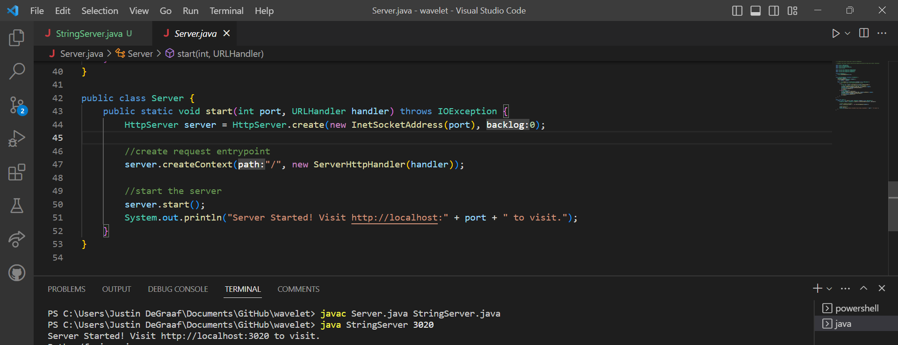
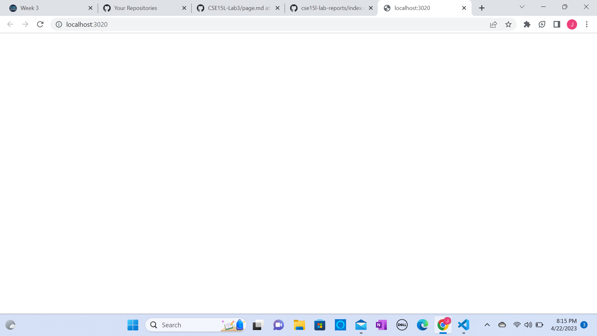
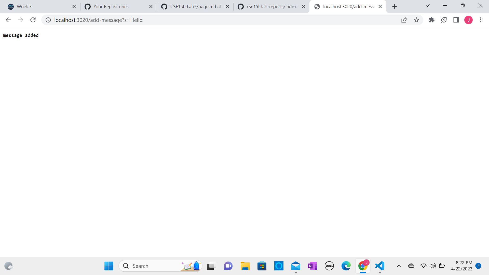
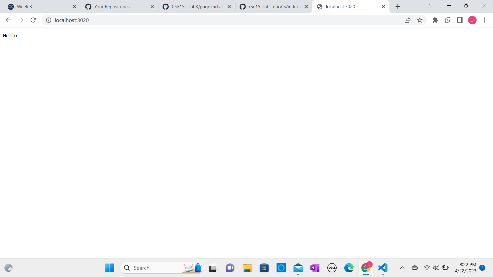
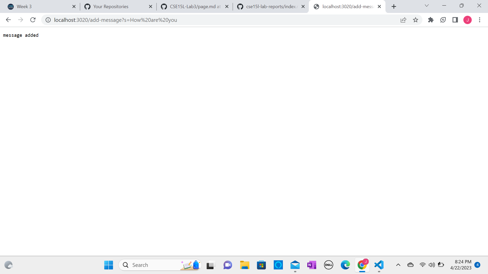
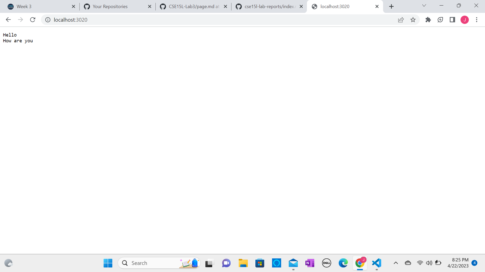
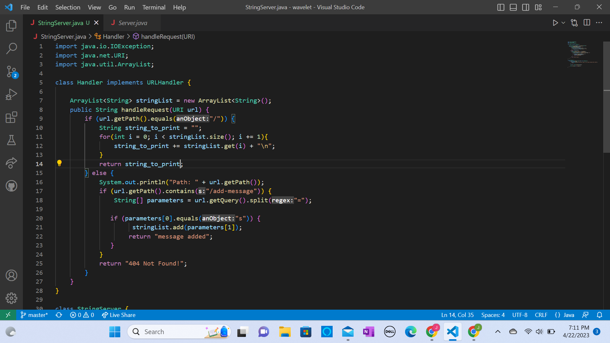
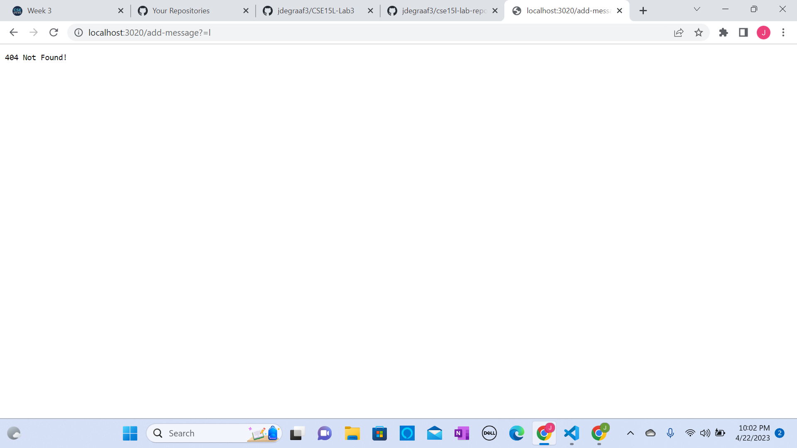
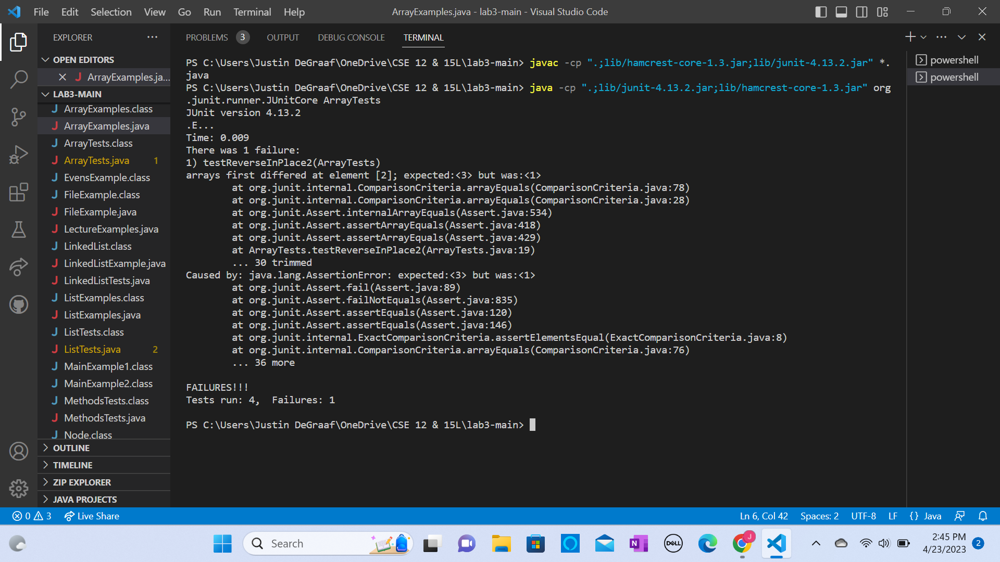

# Lab Report 2
## Part 1


The method that is first called when I compile and run my program is "start". The most relevant arguement to this class is "port", this arguement is taken when we run the program and say "java NumberServer 3020", 3020 is passed as the port arguement. It can be seen above what is done with the port number... we get our link with our given port number in it!

Here's what it looks like when we first tap the link:
 (blank page)

Here's the process of adding a message to the blank board:



Now here's what happens when we want to add another message:



After looking at this, you must be thinking, this guy has to be a master coder and a genious server creator! But it is much simpler than it looks, take a look at my code below and I will discuss what is going on.


When first initiating the server we get a blank page. This happens because in the "String" method the first if statement checks to see if the arguement "url" has a slash at the end of it. In this case our url arguement is "localhost:3020", but if you notice there is no slash at the end, well technically there is, it is inferred! If I were to just highlight and copy what is in the search bar and paste it with no edits, you get: http://localhost:3020/. Notice the Slash! So our String method first checks if the url has a slash at the end by getting its path and currently the only part of the path is the slash. So the if statement runs. First we set a local variable named "string_to_print" to a string that is nothing, we do this so that each time we want to add a new message to the board, we clear the old message from what we may have added to string_to_print previously. Now we go through our for loop which doesn't run because "stringList" has a size of 0 currently, skipping the for loop and returning the empty string_to_print, giving us our blank screen. The field stringList will be used shortly though.

When we want to add a message to the board, as seen in the 2nd picture of the page, we type in "add-message?s=(whatever message we want)". Let's just take the example Hello for now. Once we hit enter after typing this after our current link, the code will now check what is in the link again, this time it isn't just a slash, so the whole first if statement doesn't run, so now we go to our else statment and check if the term "/add-message" is in the link, which it is, so we run this if statement. Next we take everything that is after the question mark in our "add-message?s=Hello", and we put it into a local variable parameters, which is a string array, and we split the message by the equals sign into the array. So parameters will look like this: (s, Hello). Next we see if the first index of parameters is "s", which it is, so we move on to add the first index of paremater, which is "Hello" to our stringList. Once this is done we return the message, "message added", which gets printed to the board.

Now when we return to the link original link, we will now see the message "Hello" on the board. This happened through the same process in the first paragrapgh, but now we see that our stringList has a size of 1, because it currently looks like this: {"Hello"}. So our for loop will run one time adding to our empty string_to_print the 0th index of stringList, which is hello "Hello", along with an additional new line statement. string_to_print is then returned, printing out "Hello" and the new line, but we can't see the new line.

When adding another message to the board we will repeat paragraph 2, entering whatever message we want, we will take "How are you" for an example. When we return to the original link, we will set our string_to_print back to empty and then enter our for loop which will now run twice because our stringList now has a size of two looking like: {"Hello", "How are you"}. So now each string of stringList will get added to string_to_print, with "How are you" printing under "Hello" do to the new line comment we add each time we add an item of stringList to string_to_print. This gives us our final output we can see on the 4th picture of the page. We can keep adding all the messages we want to the board, each time it will follow the process of code just explained!

At any times if we ever enter something invalid we get our message at the bottom because none of the if/else statements were able to run. On the Image below notice how even an ever so slight mistake can cause an error, all that was wrong was that there was no "s" before "=".



## Part 2
Below is a non-failure inducing input for reverseInPlace from JUnit:
```
@Test 
	public void testReverseInPlace() {
    int[] input1 = { 3 };
    ArrayExamples.reverseInPlace(input1);
    assertArrayEquals(new int[]{ 3 }, input1);
	}
```
Below is a failure inducing input for reverseInPlace from JUnit:
```
  @Test
  public void testReverseInPlace2(){
    int[] input = {3,2,1};
    ArrayExamples.reverseInPlace(input);
    assertArrayEquals(new int[]{1,2,3}, input);
  }
```
  
Here is the symptom:

  
Here is the buggy code:
```
public class ArrayExamples {

  // Changes the input array to be in reversed order
  static void reverseInPlace(int[] arr) {
    for(int i = 0; i < arr.length; i += 1) {
      arr[i] = arr[arr.length - i - 1];
    }
  }
```

The issue with the code above is that once you get past a certain point, it will begin updating arr with the new elements it added at the front of the list, to the back half of the list, rather than being able to take the old elements of the list and add them to the end so arr is then reversed.\, here's how we fix it:
```
static void reverseInPlace(int[] arr) {
    int[] newArray = new int[arr.length];
    for(int i = 0; i < arr.length; i += 1) {
      newArray[i] = arr[i];
    }
    for(int i = 0; i < arr.length; i += 1) {
      arr[i] = newArray[arr.length - i - 1];
    }
  }
```

  
## Part 3
Something new I learned is how to run JUnit on Java, previously I have only used it on Eclipse. It worked well running it in Java, but I like it better in Eclipse. In Eclipse it has some better visuals and navigations to go around and see which tests either failed, passed, or had an error on.


